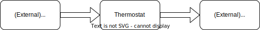

# CPP Test

## How to build

```
mkdir -p build && cd build
cmake .. && make
```

## How to run tests

```
mkdir -p build && cd build
cmake .. && make && ./tests/runTests
```

## Architecture overview

The Thermostat module is in between some "temperature sensor" and the "temperature controller" :

* The "temperature sensor" update the current temperature on the Thermostat via the "updateTemp" method.
* When the Thermostat receive the update it activate the corresponding methods (start_heating, start_cooling, stop) in the "temperature controller".


